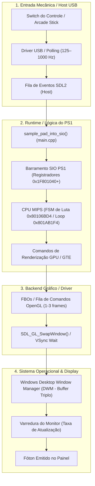

# Otimização de Input Lag (Pipeline Input-to-Photon)
## Street Fighter EX Plus Alpha (USA, SLUS-00548) — Recompilação Estática

Este documento descreve a arquitetura da cadeia de latência de entrada (*Input-to-Photon Pipeline*) no runtime `psxrecomp-plusalpha` e as estratégias técnicas para reduzir o atraso entre o comando físico do jogador e a resposta visual na tela ao mínimo absoluto no **Street Fighter EX Plus Alpha** (`SLUS-00548`), atingindo nível de precisão de torneio competitivo sem comprometer a estabilidade do hardware emulado.

---

## 1. Visão Geral da Cadeia de Latência

Em um jogo de luta 3D/2D híbrido como *Street Fighter EX Plus Alpha*, a execução roda a 59.94 Hz (aproximadamente **16.68 ms por frame**). A precisão de frames para *just-frames*, cancels de Super Combo, bloqueios e reversões exige a menor defasagem temporal possível.

Sem otimizações específicas no host e no runtime, a latência de ponta a ponta em computadores modernos acumula **entre 50 e 80 ms** (3 a 5 quadros de atraso):



As 4 estratégias atuam em cada gargalo da cadeia:

| Estratégia | Camada de Atuação | Causa Raiz do Atraso | Ganho Estimado |
| :--- | :--- | :--- | :--- |
| **A** | Apresentação / Swapchain | Espera pelo pulso vertical do monitor (VSync do driver) | **-8 a 16.6 ms** |
| **B** | Driver de Vídeo (OpenGL) | Fila de pré-renderização de comandos da GPU (1 a 3 quadros) | **-16 a 33 ms** |
| **C** | Compositor do Windows | Buffer triplo do Desktop Window Manager (DWM) em janela | **-16 ms** |
| **D** | Amostragem USB / SDL | Descompasso temporal entre leitura do evento e tick da CPU | **-4 a 8 ms** |

---

## 2. Diagnóstico do Estado Atual do Projeto (`alphaplus`)

1. **`low_latency_input` (`runtime/src/main.cpp`)**:
   - O runtime já implementa re-amostragem via `SDL_GameControllerUpdate()` e `SDL_PumpEvents()` imediatamente após o `frame_pacer_wait`, antes da apresentação. O default em código é `g_low_latency_input = 1`.
2. **Wall-Clock Frame Pacer de Alta Precisão (`runtime/src/frame_pacing.c`)**:
   - Mantém rigorosamente os 59.94 Hz do hardware NTSC original via `SDL_GetPerformanceCounter`. A velocidade da CPU e da simulação **não depende do VSync da GPU**.
3. **Anel de Telemetria (`runtime/src/latency_ring.c`)**:
   - Mede em microssegundos: `LAT_PACED`, `LAT_SWAP_BEGIN` e `LAT_SWAP_END`, consultável pela porta de debug 4531 via comando TCP `latency`.
4. **Configuração de Vídeo / Launcher**:
   - O arquivo [`PlusAlphaProject/game.toml`](game.toml) e os builds limpos ([`settings.toml`](buildClean-ucrt-s1-268/settings.toml)) não declaram a seção `[video]`, caindo no padrão `vsync = 1`.
   - O Launcher (`assets/launcher.rml` e `launcher.cpp`) **não expõe** controles para VSync ou Low Latency Input.
5. **Comportamento do Backend OpenGL (`runtime/src/gpu_gl_renderer.c`)**:
   - Os caminhos de apresentação oficiais (`present_vram` e `gl_renderer_present_wide_fbo`) **não chamam `glFlush()`** antes do swap e **não usam fences (`GLsync`)** para limitar a fila de renderização do driver de vídeo.

---

## 3. Detalhamento Técnico das Estratégias

---

### Estratégia A: Desacoplamento de VSync (`swap_interval = 0`)

#### O Problema
Com `SDL_GL_SetSwapInterval(1)` ativo, `SDL_GL_SwapWindow()` bloqueia a execução da thread até o próximo vblank do monitor físico.
- Se o monitor opera a 60.00 Hz e o pacer do jogo a 59.94 Hz, ocorre disputa de cadência (*phase slip*).
- O frame finalizado fica retido no *back buffer*, adicionando até 16.6 ms de latência estática.

#### A Solução Técnica
1. **Modo `vsync = "immediate"` (`swap_interval = 0`)**:
   - Configura `SDL_GL_SetSwapInterval(0)`.
   - O frame pronto é enviado imediatamente à tela sem aguardar o pulso vertical do monitor.
   - Como `frame_pacing.c` regula a cadência da CPU em 59.94 Hz, o jogo **não roda acelerado**.
2. **Modo `vsync = "adaptive"` (`swap_interval = -1`)**:
   - Sincroniza se o frame estiver no prazo; apresenta imediatamente se houver atraso.
3. **Regra de Sintaxe no `config_loader.cpp`**:
   - O parser TOML do `psxrecomp` **exige string** para o campo `vsync` (`"immediate"`, `"off"`, `"adaptive"`, `"on"`).
   - **NUNCA usar booleano** (`vsync = false` gera erro fatal de tipo no `toml::find<std::string>`).
   - Configuração correta em `game.toml` e `settings.toml`:
     ```toml
     [video]
     vsync = "immediate"
     low_latency_input = true
     ```

---

### Estratégia B: Redução da Fila de Renderização da GPU (Fences OpenGL)

#### O Problema
Drivers Nvidia e AMD no Windows enfileiram de 1 a 3 quadros de comandos OpenGL (*Maximum Pre-Rendered Frames*).
- Em *Street Fighter EX Plus Alpha*, o custo de renderização da GPU é inferior a 1 ms por quadro.
- A GPU termina o trabalho rapidamente, e o driver acumula frames na fila, atrasando a exibição em 1 a 2 quadros (**16 a 33 ms**).

#### A Solução Técnica
1. **Carregar `glClientWaitSync` via SDL**:
   - Em `gpu_gl_renderer.c`, adicionar `PFN_glClientWaitSync p_glClientWaitSync` ao `load_modern_gl()`.
2. **Sincronização com Fences de 1 Quadro**:
   - Após submeter o quad de apresentação:
     ```c
     if (s_frame_fence) {
         p_glClientWaitSync(s_frame_fence, PSXGL_SYNC_FLUSH_COMMANDS_BIT, 1000000000ull);
         p_glDeleteSync(s_frame_fence);
     }
     s_frame_fence = p_glFenceSync(PSXGL_SYNC_GPU_COMMANDS_COMPLETE, 0);
     glFlush();
     ```
3. **Submissão Imediata (`glFlush`)**:
   - Garante que os comandos do frame atual sejam enviados para a GPU imediatamente antes do `SDL_GL_SwapWindow()`.

---

### Estratégia C: Modo de Exibição e Bypass do DWM

#### O Problema
No Windows 10/11, janelas e janelas sem bordas passam pelo **Desktop Window Manager (DWM)** com buffer triplo invisível, gerando **~16 ms adicionais** de retenção.

#### A Solução e Cuidados no Projeto
1. **Opção de Tela Cheia Exclusiva (`SDL_WINDOW_FULLSCREEN`)**:
   - Permitir configurar `fullscreen_mode = "exclusive"` além do `borderless` (`SDL_WINDOW_FULLSCREEN_DESKTOP`).
2. **Compatibilidade com Gravação / OBS**:
   - O projeto utiliza testes com **Window Capture** no OBS (conforme documentado no `README.md`).
   - A tela cheia exclusiva não deve ser forçada como padrão único; o usuário deve poder alternar entre Janela, Sem Bordas e Exclusiva.

---

### Estratégia D: Amostragem USB e o Código em Quarentena

#### Análise Técnica do Código em Quarentena (`0x801AB1F4` e `0x801AB2C0`)
*Street Fighter EX Plus Alpha* possui rotinas de baixo nível atípicas:
- `0x801AB1F4`: Loop de polling direto do status do hardware SIO (`0x1F801044` bit `0x80`).
- `0x801AB2C0`: Monkey-patch automodificável (SMC) de 5 instruções no kernel da BIOS.
- Ambos os blocos foram **quarentenados sob o interpretador MIPS** (`dirty_ram_interp.c`) para garantir segurança de timing.

#### O Comportamento é Afetado?
**NÃO. O comportamento das rotinas em quarentena permanece 100% íntegro e seguro:**
1. **Execução Síncrona**: O interpretador MIPS e as rotinas de MMIO (`sio.c`) rodam na mesma thread/fibra do runtime. A leitura do status do SIO (`0x1F801044`) é governada pelo ciclo de clock do guest, não pelo VSync do monitor do PC.
2. **Injeção de Input**: O `sample_pad_into_sio()` alimenta o buffer emulado de controle. Reamostrar via `low_latency_input` após o pacer garante apenas que o buffer contenha os botões mais recentes quando a CPU entrar no loop de polling.
3. **Imunidade a Deadlocks**: O desengate do VSync e o uso de fences OpenGL afetam estritamente a thread de apresentação do host (`SDL_GL_SwapWindow`), sem alterar o fluxo de instruções MIPS da FSM de combate (`0x80106BD4`).

---

## 4. Integração na Interface do Launcher

Para permitir que o jogador configure a latência de forma intuitiva, as seguintes opções devem ser expostas na aba **VIDEO** de `assets/launcher.rml` e `launcher.cpp`:

1. **Vertical Sync (VSync)**:
   - Alternador cíclico: `Immediate (Menor Lag)` | `VSync (Sem Tearing)` | `Adaptive`.
   - Persistido em `settings.toml` como `vsync = "immediate"` / `"on"` / `"adaptive"`.
2. **Low-Latency Input**:
   - Alternador: `On` | `Off`.
   - Persistido em `settings.toml` como `low_latency_input = true` / `false`.

---

## 5. Protocolo de Validação e Teste de Performance

Para verificar se as otimizações causaram qualquer regressão de desempenho ou instabilidade:

### 1. Métricas Técnicas
- **Frametime (RivaTuner / MSI Afterburner)**:
  - Linha de frametime deve se manter plana a **16.6 ms** (60.0 FPS fixos).
  - Com `vsync = "immediate"`, o frametime não deve oscilar nem gerar micro-travamentos (*stutter*).
- **Carga de CPU (HWiNFO Effective Clock)**:
  - O clock efetivo deve permanecer dentro da faixa de referência (300–500 MHz), comprovando ausência de loops em *busy-wait* desgovernados.
- **Anel de Telemetria (`latency_ring`)**:
  - Consultar via porta TCP 4531 (`nc 127.0.0.1 4531` -> comando `latency`).
  - O delta `LAT_SWAP_BEGIN -> LAT_SWAP_END` deve cair de ~16.000 µs para **< 500 µs**.

### 2. Rotas de Regressão em Jogo
- **Modo Versus**: 1 partida completa (Doctrine Dark vs Ryu no cenário do Skullomania), testando cancels de Super Combo e resposta de defesa.
- **Modo Arcade**: 4 lutas consecutivas, verificando estabilidade de áudio, transições de tela e ausência de travamento no loop de polling de SIO (`0x801AB1F4`).

---

## 6. Resumo Comparativo: Padrão vs Otimizado

| Métrica | Configuração Padrão | Otimizado (A + B + C + D) |
| :--- | :--- | :--- |
| **Atraso de Apresentação (VSync)** | 8.0 a 16.6 ms | **< 1.0 ms** |
| **Fila do Driver da GPU (OpenGL)** | 16.0 a 33.3 ms (1-2 quadros) | **0.0 ms** (1 frame fence) |
| **Compositor do SO (DWM)** | ~16.0 ms (janela padrão) | **0.0 ms** (exclusivo) / 16 ms (janela) |
| **Amostragem de Input (USB/SIO)** | 4.0 a 8.0 ms (125 Hz) | **< 1.0 ms** (1000 Hz + low_latency) |
| **Latência Input-to-Photon Total** | **~44 a 74 ms (3 a 5 quadros)** | **~17 ms (~1 quadro nativo da engine)** |
