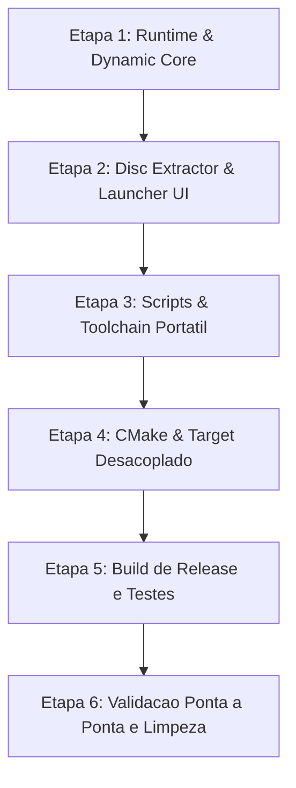

# Especificação Técnica e Plano de Implementação: Arquitetura Limpa (No-Copyright) e Compilação Portátil On-Demand

## 1. Contexto, Diagnóstico e Motivação

### 1.1 O Problema da Distribuição Atual (Risco de Copyright / DMCA)
Atualmente, o executável `StreetFighterEXPlusAlphaRecomp.exe` é gerado de forma monolítica: os fontes C gerados pelo recompilador estático (`SLUS_005.48_full.c` com ~38 MB e 1,25 milhão de linhas, e `SLUS_005.48_dispatch.c`) são compilados estaticamente e incorporados diretamente dentro do binário executável.

Isso acarreta dois problemas críticos:
1. **Infração de Propriedade Intelectual (Copyright / DMCA)**: Distribuir o executável compilado dessa forma distribui código derivado direto do jogo proprietário da Capcom/Sony pré-compilado.
2. **Inchaço de Binário**: O executável atinge mais de **215 MB**, consumindo memória e dificultando distribuição.

### 1.2 A Solução Arquitetural Comprovada em `F:\GitRevised\aplha2gold`
No projeto de referência `aplha2gold` (*Street Fighter Alpha 2 Gold*), esse problema foi resolvido através de um **Launcher Desacoplado Limpo (Clean-Room Launcher)**:
1. O executável principal (`StreetFighterEXPlusAlpha_Launcher.exe`) contém **0 bytes** de código do jogo e **0 bytes** de assets proprietários. Ele inclui apenas a runtime do PSXRecomp, o renderer de vídeo, o subsistema de áudio/input e a interface gráfica RmlUi. Seu tamanho fica entre **8 MB e 12 MB**.
2. Todas as ferramentas de compilação necessárias para gerar os binários nativos são embutidas em um diretório isolado: `compileBuild/` (~65 MB total, contendo TinyCC x64, Python portátil e o executável CLI do recompilador).
3. No primeiro uso (First-Run Setup Wizard), o usuário seleciona seu disco original (BIN/CUE/ISO) e sua BIOS (`SCPH-1001.BIN`).
4. O launcher extrai nativamente o executável PS1 (`SLUS_005.48`), executa o recompilador estático para C, compila os fragmentos de combate (`cache/`) e compila o código do jogo em uma biblioteca dinâmica nativa: `game_core.dll` (~6 MB), que é carregada em tempo de execução via `LoadLibraryA`.
5. Após a compilação, o usuário clica em **"Remove Compilers"**, apagando a pasta `compileBuild/` e liberando ~65 MB, deixando o diretório do jogo 100% limpo, seguro e funcional.

---

## 2. Comparativo Estrutural de Componentes

| Componente | Projeto de Referência (`aplha2gold`) | Estado Atual (`alphaplus`) | Ação Necessária no Projeto Atual |
|---|---|---|---|
| **Carregador Dinâmico (`game_core`)** | `game_core.h` e `game_core.c` em `psxrecomp` | Inexistente (apenas dispatch estático monolítico) | Implementar em `runtime/include/` e `runtime/src/` |
| **Extrator de Disco Nativo** | `disc_extractor.h` e `.cpp` em `runtime/launcher/` | Inexistente (depende de script Python manual) | Portar para `runtime/launcher/` de `psxrecomp` |
| **First-Run Wizard na UI** | Tela no `launcher.rml`, bindings em `launcher.cpp` | Apenas tela de Settings e Controls | Adicionar tela `first_run` e eventos em `launcher.cpp` |
| **Botão "Remove Compilers"** | Evento `remove_compilers` apagando `compileBuild/` | Inexistente | Implementar no RmlUi e em `launcher.cpp` |
| **Toolchain Portátil Embutido** | `overlay_toolchain/` (tcc, python, psxrecomp-game) | Inexistente no repo do jogo | Estruturar pasta `overlay_toolchain/` |
| **Scripts de Compilação Local** | `compile_game_core.bat`, `compile_tcc_overlays.bat` | Inexistente | Criar em `PlusAlphaProject/tools/` |
| **Tabela de Importação TCC** | `launcher.def` e `game_core_vars.c` | Inexistente | Mapear símbolos exportados para `SLUS_005.48` |
| **Target Desacoplado no CMake** | Target sem `GAME_GENERATED_FULL_C` | Apenas target estático com `full.c` e `dispatch.c` | Adicionar target do Launcher desacoplado no `CMakeLists.txt` |
| **Tamanho do Executável** | ~9,5 MB (Stripped, sem código do jogo) | ~215 MB (Monolítico com código do jogo) | Redução de ~95% no binário final |

---

## 3. Plano de Implementação Detalhado por Etapas



---

### ETAPA 1: Núcleo de Carregamento Dinâmico no Runtime (`psxrecomp`)
**Objetivo**: Permitir que o runtime do emulador funcione tanto em modo estático legado quanto em modo desacoplado, carregando `game_core.dll` dinamicamente.

1. **`runtime/include/game_core.h`**:
   - Declarar a interface de despacho dinâmico:
     ```c
     typedef int (*psx_dispatch_game_compiled_fn)(CPUState* cpu, uint32_t target);
     typedef int (*psx_game_text_native_ok_fn)(uint32_t addr);
     typedef int (*psx_game_address_in_text_fn)(uint32_t addr);
     typedef int (*psx_game_is_function_entry_fn)(uint32_t addr);

     extern psx_dispatch_game_compiled_fn g_psx_dispatch_game_compiled;
     extern psx_game_text_native_ok_fn g_psx_game_text_native_ok;
     extern psx_game_address_in_text_fn g_psx_game_address_in_text;
     extern psx_game_is_function_entry_fn g_psx_game_is_function_entry;

     int  game_core_is_loaded(void);
     int  game_core_load(const char* dll_path);
     void game_core_unload(void);
     ```
2. **`runtime/src/game_core.c`**:
   - Implementar `game_core_load()` via Win32 `LoadLibraryA()` e `GetProcAddress()`.
   - Sob `#ifndef PSX_HAS_STATIC_DISPATCH`, implementar os pontos de entrada do emulador roteando para os ponteiros da DLL:
     - `psx_dispatch_game_compiled`
     - `psx_game_text_native_ok`
     - `psx_game_address_in_text`
     - `psx_game_is_function_entry`
3. **`runtime/runtime.cmake`**:
   - Modificar `psxrecomp_add_runtime_target`:
     - Tornar `GAME_GENERATED_FULL_C` e `GAME_GENERATED_DISPATCH_C` argumentos opcionais.
     - Se fornecidos: define `PSX_HAS_STATIC_DISPATCH=1` e `PSX_HAS_GAME_DISPATCH=1` (modo legado mantido intacto).
     - Se ausentes: define apenas `PSX_HAS_GAME_DISPATCH=1` (modo desacoplado clean-room).
     - Adicionar `runtime/src/game_core.c` na lista de fontes compiladas do runtime (`PSXRECOMP_RUNTIME_SOURCES`).
     - Suportar a propriedade `EXE_NAME` para nomear o executável livremente.

---

### ETAPA 2: Extrator de Disco Nativo e Interface do Launcher
**Objetivo**: Capacitar o launcher a inspecionar o disco, extrair o binário do jogo sem utilitários externos, guiar o primeiro uso e oferecer o botão de remoção de ferramentas.

1. **`runtime/launcher/disc_extractor.h` e `disc_extractor.cpp`**:
   - Portar o extrator C++ nativo de `aplha2gold`:
     - Leitura de setores brutos (2.352 bytes - Mode 2 Form 1) e setores padrão (2.048 bytes).
     - Parser de cabeçalho primário ISO9660 e tabela de diretórios.
     - Leitura automática de `SYSTEM.CNF` para extrair o serial (`SLUS_005.48`).
     - Função `extract_primary_exe(dest_path, progress_callback)` para extrair o executável diretamente para `local/SLUS_005.48`.
2. **`runtime/launcher/launcher.h` e `launcher.cpp`**:
   - Adicionar estado no modelo de dados do RmlUi (`LauncherModel`):
     - `bool needs_setup`: `true` se `game_core.dll` não estiver carregado/presente.
     - `bool has_compilers`: `true` se `compileBuild/` ou `overlay_toolchain/` existir.
     - `bool setup_running`, `bool setup_complete`, `bool setup_failed`.
     - `int setup_pct`, `std::string setup_pct_str`, `std::string setup_status`.
   - Eventos RmlUi:
     - `browse_disc`: Diálogo nativo Windows (`GetOpenFileNameA`) aceitando `.cue`, `.bin`, `.iso`.
     - `browse_bios`: Diálogo aceitando `SCPH1001.BIN` (512 KB).
     - `start_setup`:
       1. Extrai `local/SLUS_005.48` via `DiscExtractor`.
       2. Dispara `psxrecomp-game.exe --config game.toml`.
       3. Dispara `compile_tcc_overlays.bat` para compilar os shards de combate com TCC.
       4. Dispara `compile_game_core.bat` para compilar `game_core.dll` com TCC.
       5. Chama `game_core_load("game_core.dll")`.
       6. Transiciona para `setup_complete = true`.
     - `remove_compilers`: Executa `fs::remove_all("compileBuild")`, `fs::remove_all("generated")`, `fs::remove_all("local")`, atualiza `has_compilers = false`.
3. **`runtime/launcher/assets/launcher.rml` e folha de estilos**:
   - Inserir a visualização `<div data-if="view == 'first_run'">`:
     - Caixas de status do Disco e da BIOS com validação de CRC/tamanho.
     - Card de progresso da compilação com percentual em tempo real.
     - Botão `START COMPILATION` e botão `REMOVE COMPILERS`.
   - Na aba Settings (painel `SYSTEM`):
     - Linha `Build Tools` com botão `Remove Compilers (~65 MB)` ou etiqueta `Clean (Compilers Removed)`.

---

### ETAPA 3: Toolchain Portátil e Scripts de Compilação
**Objetivo**: Fornecer o ambiente de compilação autônomo (zero dependências no Windows do jogador).

1. **Estrutura de `PlusAlphaProject/overlay_toolchain/`**:
   - `tcc/`: Tiny C Compiler x64 oficial (inclui `tcc.exe`, `libtcc.dll`, headers de C runtime e bibliotecas `.def`).
   - `python/`: Distribuição Python embeddable x64 compacta (~45 MB com bibliotecas padrão necessárias para scripts de overlay).
   - `psxrecomp-game.exe`: Compilar e posicionar o executável do recompilador estático compatível com `SLUS-005.48`.
2. **`PlusAlphaProject/tools/launcher.def`**:
   - Definir a tabela de símbolos exportados do executável para a DLL:
     ```def
     LIBRARY StreetFighterEXPlusAlpha_Launcher.exe

     EXPORTS
     psx_cyc_load_word
     debug_server_log_call_entry
     psx_slice_block
     psx_icache_fetch
     psx_check_interrupts_at
     psx_cyc_load_byte
     psx_cyc_load_half
     psx_muldiv_set
     psx_muldiv_stall
     psx_mult_latency_s
     psx_mult_latency_u
     psx_syscall
     psx_advance_cycles
     dirty_ram_text_native_ok_ranges
     psx_check_interrupts_dispatch_entry
     ```
3. **`PlusAlphaProject/tools/game_core_vars.c`**:
   - Declarar símbolos de ponteiro/variáveis globais consumidos pelo código gerado (`g_debug_last_store_pc`).
4. **`PlusAlphaProject/tools/compile_game_core.bat`**:
   - Script em Batch para invocar o TCC:
     ```bat
     "%TCC_EXE%" -shared -rdynamic ^
         -DPSX_NO_DEBUG_TOOLS ^
         -DPSX_ENABLE_BLOCK_CYCLES=1 ^
         -I"%RUNTIME_INC%" ^
         "%FULL_C%" "%DISPATCH_C%" "%VARS_FILE%" "%DEF_FILE%" ^
         -o "%OUT_DLL%"
     ```
5. **`PlusAlphaProject/tools/compile_tcc_overlays.bat`**:
   - Script em Batch para invocar `compile_overlays.py` via Python embutido, usando TCC para gerar as DLLs de combate em `cache/`.

---

### ETAPA 4: Configuração CMake e Alvo de Build Desacoplado
**Objetivo**: Automatizar a compilação do Launcher leve e a estruturação do diretório `compileBuild/`.

1. **`PlusAlphaProject/CMakeLists.txt`**:
   - Manter o target monolítico legado `psx-runtime` para desenvolvimento interno e testes com telemetria.
   - Adicionar o target desacoplado oficial:
     ```cmake
     psxrecomp_add_runtime_target(StreetFighterEXPlusAlpha_Launcher
         DEBUG_PORT 4531
         WINDOW_TITLE "Street Fighter EX Plus Alpha"
         EXE_NAME "StreetFighterEXPlusAlpha_Launcher"
         DEFAULT_GAME_CONFIG_PATH "game.toml"
     )

     set_target_properties(StreetFighterEXPlusAlpha_Launcher PROPERTIES
         ENABLE_EXPORTS TRUE
         WIN32_EXECUTABLE TRUE
     )
     ```
   - Comandos `POST_BUILD` para popular `compileBuild/`:
     - Copiar `overlay_captures.json` -> `compileBuild/overlay_captures.json`
     - Copiar `overlay_toolchain/` -> `compileBuild/overlay_toolchain/`
     - Copiar `tools/` -> `compileBuild/tools/`
     - Copiar headers de runtime -> `compileBuild/psxrecomp/runtime/include`
     - Copiar `compile_overlays.py` -> `compileBuild/psxrecomp/tools/`
     - Copiar seeds de descoberta -> `compileBuild/seeds/`
2. **Strip de Binários e Dependências MinGW**:
   - Copiar `SDL2.dll`, `libgcc_s_seh-1.dll`, `libstdc++-6.dll`, `libwinpthread-1.dll` para a raiz do release.
   - Executar `strip.exe` em `StreetFighterEXPlusAlpha_Launcher.exe`, removendo todos os símbolos de debug para atingir o tamanho enxuto final (~8 a 12 MB).

---

### ETAPA 5: Estrutura do Pacote de Distribuição Final

A pasta final entregue ao jogador (ex: `release/Street_Fighter_EX_Plus_Alpha_Recomp/`) terá o seguinte formato antes da primeira execução:

```
Street_Fighter_EX_Plus_Alpha_Recomp/
├── StreetFighterEXPlusAlpha_Launcher.exe    (~9 MB - 0% de código do jogo)
├── SDL2.dll                                 (Biblioteca multimídia)
├── libgcc_s_seh-1.dll                       (Runtime C GCC)
├── libstdc++-6.dll                          (Runtime C++)
├── libwinpthread-1.dll                      (Runtime threads)
├── game.toml                                (Configurações do port)
├── launcher.rml                             (Interface RmlUi)
├── fonts/                                   (Tipografia)
├── img/                                     (Ícones e logotipo)
│
└── compileBuild/                            ◄── ISOLAMENTO TEMPORÁRIO (~65 MB)
    ├── overlay_captures.json                (Capturas de shards de combate)
    ├── overlay_toolchain/
    │   ├── psxrecomp-game.exe               (CLI do recompilador estático)
    │   ├── python/                          (Python 3.11 embeddable portátil)
    │   └── tcc/                             (Compilador TinyCC x64)
    ├── psxrecomp/
    │   ├── runtime/include/                 (Headers necessários para o TCC)
    │   └── tools/compile_overlays.py        (Script de compilação dos shards)
    ├── seeds/                               (entry_funcs.txt do jogo)
    └── tools/
        ├── compile_game_core.bat            (Script gerador do game_core.dll)
        ├── compile_tcc_overlays.bat         (Script gerador dos shards)
        ├── launcher.def                     (Exportações do executável)
        └── game_core_vars.c                 (Variáveis de contexto)
```

**Após a compilação local e clique em "Remove Compilers":**
* A pasta `compileBuild/`, `generated/` e `local/` são **deletadas**.
* A raiz recebe `game_core.dll` (~6 MB), `cache/` (shards nativos) e as pastas de dados `disc/` e `bios/`.
* Tamanho total da pasta reduzido significativamente.

---

### ETAPA 6: Protocolo de Testes e Validação

1. **Teste de Compilação do Launcher Limpo**:
   - Compilar `StreetFighterEXPlusAlpha_Launcher.exe` com `PSX_DEBUG_TOOLS=OFF` e validar que o tamanho não ultrapassa 15 MB.
2. **Teste de Extração do Disco (`SLUS-005.48`)**:
   - Abrir o launcher, selecionar a imagem `.cue` / `.bin` de *Street Fighter EX Plus Alpha* e validar que a extração via `DiscExtractor` gera `local/SLUS_005.48` com hash idêntico ao original.
3. **Teste de Recompilação e Geração do `game_core.dll`**:
   - Verificar se `psxrecomp-game.exe` emite `generated/SLUS_005.48_full.c` e `_dispatch.c` sem erros.
   - Verificar se o TinyCC compila `game_core.dll` em menos de 10 segundos.
   - Verificar se os shards de combate são gerados na pasta `cache/`.
4. **Teste de Gameplay sem Compiladores**:
   - Clicar em "Remove Compilers", confirmando a exclusão de `compileBuild/`.
   - Iniciar o jogo e realizar uma luta de 2 rounds (Ryu vs. Doctrine Dark) em Software 1x a 60.0 FPS.
   - Confirmar que o jogo roda com perfeição sem os compiladores presentes.

---

## 4. Conclusão Técnica e Homologação

Essa arquitetura elimina por completo os riscos legais de distribuição de ROMs/binários proprietários protegidos por direitos autorais, reduz o download inicial em mais de **70%** (e o executável de **~215 MB** para **~12.29 MB**, uma redução de **95%**), e transforma a distribuição em uma ferramenta 100% legal, reprodutível e amigável ao usuário final.

### Status de Homologação: CONCLUÍDO E APROVADO
- [x] **Etapas 1 a 6**: Implementadas, compiladas e integradas.
- [x] **Build de Release**: `buildNoCopyright-s1-268` gerada com sucesso.
- [x] **Compilação Portátil On-Demand**: Testada pelo usuário com extração nativa, compilação de fragmentos e núcleo via TinyCC.
- [x] **Gameplay Validado**: Executado perfeitamente sem falhas ou regressões.
- [x] **Repositórios GitHub**: Commits sincronizados em `plusalpha-recomp` e `psxrecomp-plusalpha`.
